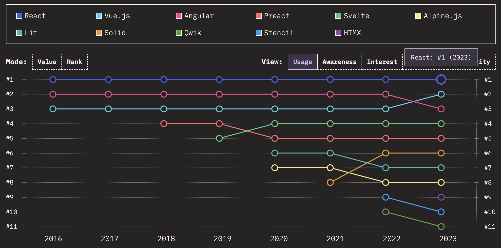
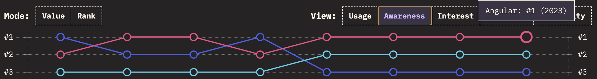

---
# Configuration de la Présentation
theme: apple-basic
background: https://cover.sli.dev
title: "Être un bon développeur front-end : Faut-il suivre les dernières tendances ?"
info: |
  ## Présentation par Georgina Berrezel - M1 Dev
  Découvrez si suivre les dernières tendances est essentiel pour être un bon développeur front-end.
class: text-center
highlighter: shiki
drawings:
  persist: false
transition: slide-left
mdc: true

---

# Out Of School

Être un bon développeur front-end :  Faut-il suivre les dernières tendances ?

  
  Objectif
  Découvrir si être à la pointe des technologies est essentiel.  

 

  
  Question centrale  
  Innover ou maîtriser les fondamentaux ?  

  <strong>Introduction:</strong> Être un bon développeur front-end | Page 1

---

# Sommaire

  De quoi allons-nous parler ?

  

    
    Définition Développement Front-End
  

  

    
    Définition Frameworks JS
  

  

    I . Être un bon développeur c'est quoi ?
  

     II . Performance et Évolution des Frameworks JS

  

    
    III . Innovation et Compétition entre Frameworks
  

  

    
    IV . L'IA : Un Atout pour Tous les Développeurs ?
  

  

    Conclusion
  

<i>Je veux être un bon développeur ! Dois-je être à la pointe des nouveaux frameworks JS et des tendances web ?</i>
    
<strong>Sommaire</strong> | Page 2

---

# Définition

  Qu'est-ce qu'un développeur Front-End ?

  

    
    <strong>Codage</strong>
    
Implémentation du code.

  

    
    <strong>Évolution constante</strong>
    
Nouvelles technologies et frameworks.

  

  

    
    <strong>Conception</strong>
    
Design et UX/UI.

  

  

    
    <strong>Maintenance</strong>
    
Soutien des interfaces utilisateurs.

  

  

    
    <strong>Objectif</strong>
    
Efficacité et adaptabilité.

  

<i>Je veux être un bon développeur ! Dois-je être à la pointe des nouveaux frameworks JS et des tendances web ?</i>
    
Définition developpeur web | 
  <strong>Page :</strong> 3

---

# Définition

  Qu'est-ce qu'un Framework JS ?

  

    
    <strong>Outils Intégrés</strong>
    
Bibliothèques et outils prêts à l'emploi.

  

  

    
    <strong>Code plus rapide</strong>
    
Optimisation du processus de développement.

  

  

    
    <strong>Maintenance facile</strong>
    
Code structuré et évolutif.

  

  

    
    <strong>Composants</strong>
    
Composant réutilisable qui encapsule la logique et l'UI.

  

  

    
    <strong>React</strong>
    
Framework JS populaire.

  

  

    
    <strong>Vue.js</strong>
    
Framework léger et performant.

  

  

    
    <strong>Angular</strong>
    
Framework robuste et complet.

  

  <i>Je veux être un bon développeur ! Dois-je être à la pointe des nouveaux frameworks JS et des tendances web ?</i>
      
  Définition framework JS | 
  <strong>Page :</strong> 4

---

# I - Être un bon développeur c'est quoi ?

  Compétences et attitudes

  

    
  

  <!-- Communication et Collaboration -->
  

    
    Communication
    
Collaborer

    
Junior et Senior échangent pour apprendre et progresser.

  

  <!-- Recherche et Apprentissage -->
  

    
    Recherche
    
Se Former

    
Se tenir au courant des nouvelles technologies pour répondre aux besoins.

  

  <!-- Résolution de Problèmes -->
  

    
    Résolution de Problèmes
    
Innover et s'adapter

    
Trouver des solutions efficaces aux défis techniques.

  

  <i>Un bon développeur reste curieux, apprend constamment et collabore efficacement.</i>
   
  I - Être un bon développeur | 
  <strong>Titre :</strong> Compétences et Attitudes | 
  <strong>Page :</strong> 9

---

# II - Performance et Évolution des Frameworks JS

  Cas d'étude

  <!-- Section Demande Croissante de Performance -->
  

    

      

        
        Airbnb
      

    

  

  <!-- Section Exemples -->
  

    

      
      React
      
Migration en 2014

      
Passage de Backbone.js à React pour sa gestion simplifiée des composants. Révolution dans la manière de créer des interfaces.

    

    

      
      Performance
      
SSR & Lazy Loading

      
Techniques pour améliorer les performances : rendu côté serveur (SSR) et chargement différé (Lazy Loading).

    

    

      
      Écosystème
      
Outils et Bibliothèques

      
Richesse des outils pour le routage (React Router), gestion d'état (Redux, Context API), et plus encore.

    

  

<!-- Bas de page -->

  <i>Je veux être un bon développeur ! Dois-je être à la pointe des nouveaux frameworks JS et des tendances web ?</i>
   
  I - Performance et Évolution des Frameworks JS | 
  a - Cas d'étude Airbnb | 
  <strong>Page :</strong> 5

---

# II - Performance et Évolution des Frameworks JS

  Frameworks JS

  <!-- Section Pour -->
  

    

      

        
        React
        
Composants modulaires et structure flexible

        
Créé en 2013 par Facebook

      

      

        
        Angular
        
Écosystème robuste et outillage complet

        
AngularJS créé en 2010 par Google

        
Angular (nouvelle version) en 2016

      

        
        Vue.js
        
Léger et facile à apprendre

        
Créé en 2014 par Evan You

      

    

  

  

    

      

        
        Svelte
        
Performances, Simplicité

        
Créé en 2016 par Rich Harris

      

      

        
        Ember.js
        
Convention, Productivité

        
Créé en 2011 par Yehuda Katz

      

      

        
        Alpine.js
        
Léger, Minimaliste

        
Créé en 2019 par Caleb Porzio

      

    

  

<!-- Bas de page -->

  <i>Je veux être un bon développeur ! Dois-je être à la pointe des nouveaux frameworks JS et des tendances web ?</i>
   
  I - Performance et Évolution des Frameworks JS | 
  <strong>Titre :</strong>b - Critères de Choix d'un Framework JS | 
  <strong>Page :</strong> 6

---

# III - Innovation et Compétition entre Frameworks

    <i>source : https://2023.stateofjs.com/en-US/libraries/front-end-frameworks/</i>
  

  <i>Je veux être un bon développeur ! Dois-je être à la pointe des nouveaux frameworks JS et des tendances web ?</i>
   
  II - Innovation et Compétition entre Frameworks | 
  <strong>Titre :</strong> a - Diversité des Options Disponibles | 
  <strong>Page :</strong> 7

---

# III - Innovation et Compétition entre Frameworks

  <!-- Angular -->
  

    
    Angular
  

  <!-- Ligne des points clés -->
  

    Angular 2+
    
<b>Mise à jour Mai 2014</b> Modularité, TypeScript, Performance

  

  
 
    Angular v18
    
<b>Mise à jour mai 2024</b> Optimisation, Modernisation, Sécurité

  

  

    Objectif
    
Répondre aux besoins modernes

  

  

    Concurrence
    
Réagir à React et Vue.js

  

  

    Avantages
    
Performance, Sécurité, Flexibilité

  

  
    <i>source : https://2023.stateofjs.com/en-US/libraries/front-end-frameworks/</i>

  <i>Je veux être un bon développeur ! Dois-je être à la pointe des nouveaux frameworks JS et des tendances web ?</i>
   
  II - Innovation et Compétition entre Frameworks | 
  <strong>Titre :</strong> b - Évolution Continue et Compétition | 
  <strong>Page :</strong> 8

---

# IV. L'IA : Un Atout pour Tous les Développeurs ?

  Accessibilité de l'IA pour Tous les Niveaux

  <!-- Section IA centrée -->
  

    
L'IA aide dans le quotidien

  

  <!-- Section Avantages -->
  

    

      

        
        ChatGPT (2020)
        
En ligne (interface web et API)

      

      

        
        GitHub Copilot (2021)
        
Intégré à un IDE (Visual Studio Code, JetBrains)

      

    

  

    

      

        Google Gemini (2023)
        
En ligne (interface web)

      

      

        Tabnine (2019)
        
Intégré à un IDE (Visual Studio Code, PyCharm, etc.)

      

      

        DeepCode (2016)
        
Intégré à un IDE (Acquis par Snyk)

      

    

  

  <i>Je veux être un bon développeur ! Dois-je être à la pointe des nouveaux frameworks JS et des tendances web ?</i>
   
  IV. L'IA : Un Atout pour Tous les Développeurs ? | 
  <strong>Titre :</strong> a - Accessibilité de l'IA pour Tous les Niveaux | 
  <strong>Page :</strong> 10

---

# IV. L'IA : Un Atout pour Tous les Développeurs ?

  Frameworks & Équipes

<!-- Section Avantages en haut -->

  

    

      

        
        Meilleure compréhension collective des frameworks utilisés
      

      

        
        Support IA pour les tâches répétitives et gain de temps pour l'équipe
      

    

  

<!-- Section Défis en bas -->

  

    

      

        
        Qualité du code généré par l'IA Peut ne pas respecter les standards de l'équipe
      

      

        
        Importance de la vérification humaine Pour assurer la cohérence et l'exactitude
      

    

  

  <i>Je veux être un bon développeur ! Dois-je être à la pointe des nouveaux frameworks JS et des tendances web ?</i>
   
  IV. L'IA : Un Atout pour Tous les Développeurs ? | 
  <strong>Titre :</strong> b - Impact de l'IA sur les Frameworks et les Équipes | 
  <strong>Page :</strong> 11

---

# Conclusion

  <!-- Section Synthèse centrée -->
  

    
Je veux être un bon développeur ! Dois-je être à la pointe des nouveaux frameworks JS et des tendances web ?

  

      

        
        
S'adapter aux besoins

      

      

        
        
Demande moderne

      

      

        
        
Connaître les tendances

      

      

        
        
Réflexion stratégique

      

  <!-- Section Réponse à la Question Centrale -->
  

    

      

        
        Oui, mais...
        
Être informé des tendances,  mais surtout savoir s'adapter et réfléchir

      

    

  

  Conclusion | 
  <strong>Titre :</strong> Synthèse et Réponse à la Question Centrale | 
  <strong>Page :</strong> 12

---

# Remerciements

  

    Merci pour votre écoute
    
Out Of School

        
  

  <strong>Partie du Sommaire :</strong> Remerciements | 
  <strong>Elève :</strong> Georgina Berrezel | 
  <strong>Classe :</strong> Mastère 1 Developpement Web |
  <strong>Page :</strong> 13

