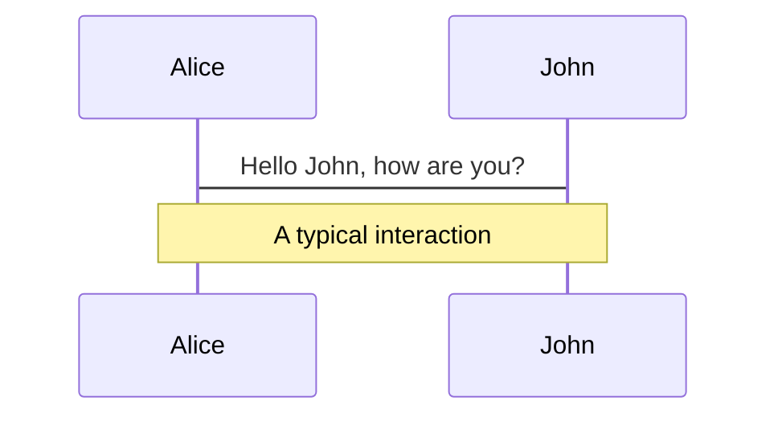
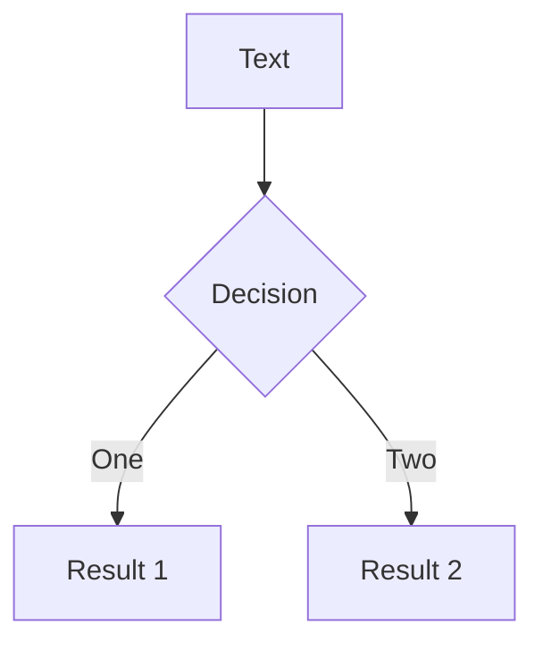
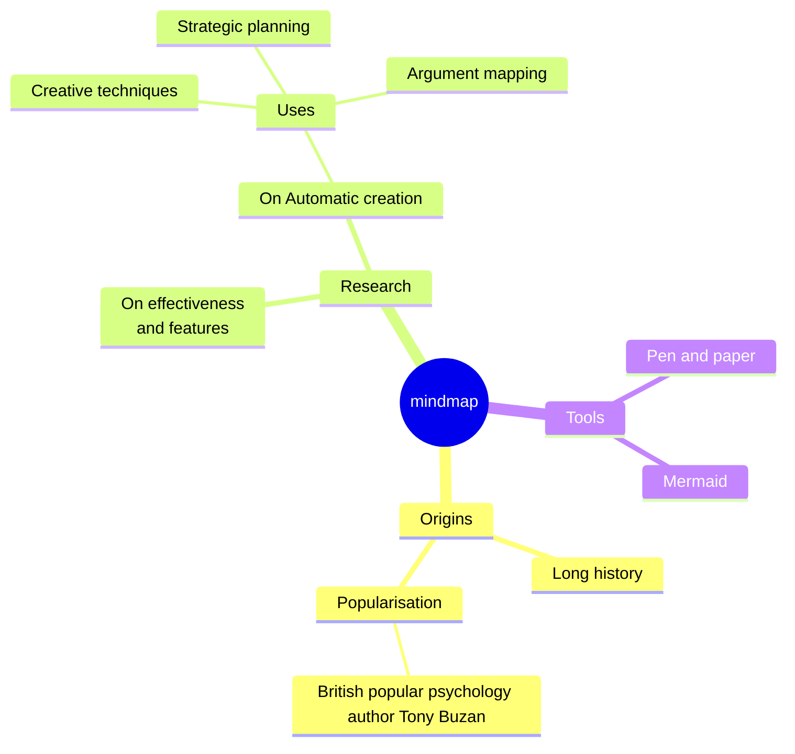
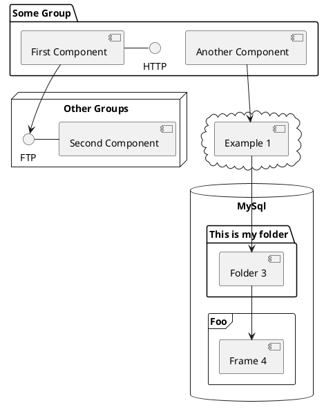

---
# try also 'default' to start simple
theme: apple-basic
# random image from a curated Unsplash collection by Anthony
# like them? see https://unsplash.com/collections/94734566/slidev
background: https://cover.sli.dev
# some information about your slides, markdown enabled
title: Welcome to Digital culture
info: |
  ## Slidev Starter Template
  Presentation slides for developers.

  Learn more at [Sli.dev](https://sli.dev)
# apply any unocss classes to the current slide
class: text-center
# https://sli.dev/custom/highlighters.html
highlighter: shiki
# https://sli.dev/guide/drawing
drawings:
  persist: false
# slide transition: https://sli.dev/guide/animations#slide-transitions
transition: slide-left
# enable MDC Syntax: https://sli.dev/guide/syntax#mdc-syntax
mdc: true
---

# Do you have to be up to date with the latest JS frameworks and web trends to be a good developer?

Digital culture

<div class="pt-12">
  <span @click="$slidev.nav.next" class="px-2 py-1 rounded cursor-pointer" hover="bg-white bg-opacity-10">
    Press Space for next page <carbon:arrow-right class="inline"/>
  </span>
</div>

<div class="abs-br m-6 flex gap-2">
  <button @click="$slidev.nav.openInEditor()" title="Open in Editor" class="text-xl slidev-icon-btn opacity-50 !border-none !hover:text-white">
    <carbon:edit />
  </button>
  <a href="https://github.com/slidevjs/slidev" target="_blank" alt="GitHub" title="Open in GitHub"
    class="text-xl slidev-icon-btn opacity-50 !border-none !hover:text-white">
    <carbon-logo-github />
  </a>
</div>

<!--
The last comment block of each slide will be treated as slide notes. It will be visible and editable in Presenter Mode along with the slide. [Read more in the docs](https://sli.dev/guide/syntax.html#notes)
-->


<!--
Here is another comment.
-->

---
transition: fade-out
layout: two-cols
layoutClass: gap-16
---

# Summary

Do you have to be up to date with the latest JS frameworks and web trends to be a good developer?

::right::

<Toc v-click minDepth="1" maxDepth="2"></Toc>


---
transition: slide-up
level: 2
---

# 📈L’évolution des frameworks JS et la quête de performance


[//]: # ()

[//]: # (## Keyboard Shortcuts)

[//]: # ()

[//]: # (|                                                     |                             |)

[//]: # (|-----------------------------------------------------|-----------------------------|)

[//]: # (| <kbd>right</kbd> / <kbd>space</kbd>                 | next animation or slide     |)

[//]: # (| <kbd>left</kbd>  / <kbd>shift</kbd><kbd>space</kbd> | previous animation or slide |)

[//]: # (| <kbd>up</kbd>                                       | previous slide              |)

[//]: # (| <kbd>down</kbd>                                     | next slide                  |)

<!-- https://sli.dev/guide/animations.html#click-animations -->

<p v-after class="absolute bottom-23 left-45 opacity-30 transform -rotate-10">Here!</p>


---
layout: image-right
image: ./stateofjs-ratio-overtime.png
---

# I - Demande croissante de performance

Les utilisateurs exigent des applications web de plus en plus rapides et réactives, ce qui pousse les développeurs à
utiliser des frameworks qui optimisent les performances.

---
transition: slide-up
level: 3
---

# I - Demande croissante de performance

Les attentes des utilisateurs modernes
Les utilisateurs d'aujourd'hui ont des attentes élevées en matière de performance des applications web. Plusieurs
facteurs contribuent à cette demande croissante :

`Vitesse de chargement`

<div v-click>

```html

<div v-click>Les utilisateurs s'attendent à ce que les pages web se chargent en quelques secondes, voire
    moins. Des temps de chargement rapides sont essentiels pour améliorer l'expérience utilisateur et réduire les taux
    de
    rebond. Google a également souligné l'importance de la vitesse de chargement pour le référencement, ce qui incite
    encore
    plus les développeurs à optimiser les performances.
</div>
```

</div>

<br>

<v-click>

<span v-mark.red="3"><code>Réactivité</code></span>

[//]: # (also allows you to add)

[//]: # (<span v-mark.circle.orange="4">inline marks</span>)

[//]: # (, powered by [Rough Notation]&#40;https://roughnotation.com/&#41;:)

```html
<span v-mark.underline.orange> : Une fois la page chargée, les interactions avec le site doivent être fluides et instantanées. Cela inclut
des actions comme la navigation, le défilement, et l'interaction avec les éléments de la page (par exemple, des
formulaires, des boutons, etc.).</span>
```

</v-click>

<div mt-20 v-click>

[Learn More](https://sli.dev/guide/animations#click-animations)

</div>

---

[//]: # (# I - Demande croissante de performance)

`Expérience utilisateur (UX)`

<div v-click>

```html

<div v-click>Une bonne performance est un élément clé d'une expérience utilisateur positive. Les
    utilisateurs sont moins tolérants envers les sites lents ou non réactifs et sont plus susceptibles de quitter un
    site ou
    de ne pas y revenir s'ils rencontrent des problèmes de performance.
</div>
```

</div>


---

# I - Demande croissante de performance

Rôle des frameworks JavaScript

Pour répondre à ces exigences, les développeurs se tournent vers des frameworks JavaScript modernes qui offrent des
outils et des fonctionnalités pour optimiser les performances. Voici comment ces frameworks contribuent à améliorer la
performance des applications web :

`Rendu côté client vs côté serveur`

<div v-click>

```html

<div v-click> : Certains frameworks permettent un rendu côté serveur (SSR) ou un rendu statique, ce
    qui peut réduire le temps de chargement initial de la page. D'autres, comme React avec ReactDOM, se concentrent sur
    le
    rendu côté client, permettant des interactions ultra-rapides après le chargement initial.
</div>
```

</div>

<br>

`Chargement paresseux (Lazy Loading)`

<div v-click>

```html

<div v-click> Les frameworks modernes intègrent souvent des techniques de chargement paresseux
    pour différer le chargement de contenu non critique jusqu'à ce qu'il soit nécessaire. Cela améliore le temps de
    chargement initial et réduit la consommation de bande passante.
</div>
```

</div>

---

# I - Demande croissante de performance

`Gestion de l'état efficace`

<div v-click>

```html

<div v-click>Les frameworks offrent des solutions sophistiquées pour la gestion de l'état de l'
    application, ce qui permet de minimiser les recalculs et les re-rendus inutiles. Cela contribue à des interactions
    plus
    rapides et à une expérience utilisateur plus fluide.
</div>
```

</div>

<br>

`Optimisation des bundles`

<div v-click>

```html

<div v-click>Les outils de build modernes, souvent intégrés aux frameworks, permettent de créer des
    bundles JavaScript optimisés et minifiés, réduisant ainsi la taille des fichiers envoyés au client et améliorant les
    temps de chargement.
</div>
```

</div>


---

# I - Demande croissante de performance

Exemples de frameworks performants

`React`

<div v-click>

```html

<div v-click>Utilisé par de grandes entreprises comme Facebook et Instagram, React permet de créer des interfaces
    utilisateur
    réactives et performantes grâce à son DOM virtuel et à ses techniques de mise à jour efficace.
</div>
```

</div>

<br>

`Vue.js`

<div v-click>

```html

<div v-click>Connu pour sa simplicité et sa flexibilité, Vue.js permet également des optimisations de performance avec
    son
    DOM virtuel et sa gestion de composants légers.
</div>
```

</div>

---

`Svelte`

<div v-click>

```html

<div v-click>Contrairement à React et Vue, Svelte convertit les composants en un code JavaScript ultra-optimisé au
    moment de
    la compilation, éliminant ainsi le besoin d'un DOM virtuel et améliorant la performance.
</div>
```

</div>

<br>

`Angular`

<div v-click>

```html

<div v-click>Un framework complet qui offre des outils puissants pour optimiser les performances, notamment par le biais
    de
    l'injection de dépendances et du rendu côté serveur.
</div>
```

</div>


En conclusion, la demande croissante de performance pousse les développeurs à utiliser des frameworks JavaScript
modernes qui offrent des outils et des techniques pour optimiser les applications web. Ces frameworks permettent de
répondre aux attentes des utilisateurs en matière de vitesse, de réactivité et de qualité de l'expérience utilisateur.

---

[//]: # (```ts {all|5|7|7-8|10|all} twoslash)

[//]: # (// TwoSlash enables TypeScript hover information)

[//]: # (// and errors in markdown code blocks)

[//]: # (// More at https://shiki.style/packages/twoslash)

[//]: # ()

[//]: # (import {computed, ref} from 'vue')

[//]: # ()

[//]: # (const count = ref&#40;0&#41;)

[//]: # (const doubled = computed&#40;&#40;&#41; => count.value * 2&#41;)

[//]: # ()

[//]: # (doubled.value = 2)

[//]: # (```)

[//]: # (<arrow v-click="[4, 5]" x1="350" y1="310" x2="195" y2="334" color="#953" width="2" arrowSize="1" />)

<!-- This allow you to embed external code blocks -->

[//]: # (<<< @/snippets/external.ts#snippet)

<!-- Footer -->

[//]: # ([^1]: [Learn More]&#40;https://sli.dev/guide/syntax.html#line-highlighting&#41;)

<!-- Inline style -->

[//]: # (<style>)

[//]: # (.footnotes-sep {)

[//]: # (  @apply mt-5 opacity-10;)

[//]: # (})

[//]: # (.footnotes {)

[//]: # (  @apply text-sm opacity-75;)

[//]: # (})

[//]: # (.footnote-backref {)

[//]: # (  display: none;)

[//]: # (})

[//]: # (</style>)

<!--
Notes can also sync with clicks

[click] This will be highlighted after the first click

[click] Highlighted with `count = ref(0)`

[click:3] Last click (skip two clicks)
-->

---
layout: image-left
image: ./stateofjs-ratio-overtime.png
---

# II - Innovation et compétition entre les frameworks

Différentes options de frameworks JS disponibles, de leur évolution constante pour répondre aux besoins
changeants du marché et de la compétition entre eux pour attirer les
développeurs. [learn more](https://2022.stateofjs.com/en-US/libraries/front-end-frameworks/)

---
level: 2
---

# II - Innovation et compétition entre les frameworks

Diversité des options disponibles

Le paysage des frameworks JavaScript est riche et diversifié, offrant de nombreuses options aux développeurs. Voici
quelques-uns des principaux frameworks et leurs caractéristiques distinctives :

`React `

<div v-click>

```html

<div v-click>Créé par Facebook, React est une bibliothèque JavaScript centrée sur la construction d'interfaces
    utilisateur
    réactives. Sa popularité repose sur son approche innovante du DOM virtuel, qui permet des mises à jour de
    l'interface
    utilisateur ultra-rapides.
</div>
```

</div>

<br>

`Angular`

<div v-click>

```html

<div v-click>Développé par Google, Angular est un framework complet qui offre une architecture robuste et une riche
    suite
    d'outils pour le développement d'applications web. Il est connu pour sa puissante fonctionnalité d'injection de
    dépendances et sa capacité à gérer des applications complexes.
</div>
```

</div>

---

Diversité des options disponibles

`Vue.js`

<div v-click>

```html

<div v-click>Vue.js se distingue par sa simplicité et sa flexibilité. Il combine les meilleures idées de React et
    Angular,
    offrant une courbe d'apprentissage douce tout en permettant de créer des applications performantes et maintenables.
</div>
```

</div>

<br>

`Svelte`

<div v-click>

```html

<div v-click>Svelte adopte une approche différente en compilant les composants en du JavaScript pur à l'étape de la
    construction. Cela élimine le besoin d'un DOM virtuel et peut conduire à des performances améliorées et à des
    tailles de
    bundle plus petites.
</div>
```

</div>

---

# II - Innovation et compétition entre les frameworks

Évolution constante pour répondre aux besoins du marché

Les frameworks JavaScript évoluent constamment pour s'adapter aux besoins changeants des développeurs et du marché.
Voici quelques-unes des tendances et évolutions récentes :

`Performance`

<div v-click>

```html

<div v-click>Les améliorations continues en matière de performance sont une priorité. Les frameworks optimisent
    constamment le rendu, la gestion de l'état et les temps de chargement pour offrir des expériences utilisateur plus
    rapides et plus fluides.
</div>
```

</div>

<br>

`Modularité et extensibilité`

<div v-click>

```html

<div v-click>Les frameworks deviennent de plus en plus modulaires, permettant aux développeurs de
    choisir et de composer des fonctionnalités selon leurs besoins spécifiques. Cela favorise la réutilisabilité et la
    maintenance du code.
</div>
```

</div>

---

Évolution constante pour répondre aux besoins du marché

`TypeScript`

<div v-click>

```html

<div v-click>De plus en plus de frameworks adoptent TypeScript, un sur-ensemble de JavaScript qui ajoute des types
    statiques. Cela améliore la qualité du code, facilite la collaboration en équipe et réduit les erreurs au moment de
    la
    compilation.
</div>
```

</div>

<br>

`Outillage et écosystème`

<div v-click>

```html

<div v-click>L'écosystème des outils autour des frameworks s'enrichit. Cela inclut des bibliothèques pour
    le routage, la gestion de l'état, le testing, le déploiement, etc. Un écosystème robuste aide les développeurs à
    être
    plus productifs et à créer des applications plus robustes.
</div>
```

</div>

---

# II - Innovation et compétition entre les frameworks

Compétition entre les frameworks

La compétition entre les frameworks JavaScript est intense et se manifeste de plusieurs manières :

`Communauté et support`

<div v-click>

```html

<div v-click>Les frameworks cherchent à attirer des communautés de développeurs actives et engagées. Une
    grande communauté signifie plus de ressources, de tutoriels, de plugins et de support pour les développeurs.
```

</div>

<br>

`Adoption par les entreprises`

<div v-click>

```html

<div v-click>Les frameworks se battent pour être adoptés par les grandes entreprises et les projets de
    haut profil. L'adoption par des entreprises de renom peut servir de preuve de fiabilité et de performance.
</div>
```

</div>

---

Évolution constante pour répondre aux besoins du marché

`Innovation technologique`

<div v-click>

```html

<div v-click>Chaque framework essaie de se différencier par l'innovation. Par exemple, React a popularisé
    le concept du DOM virtuel, tandis que Svelte propose une compilation des composants en JavaScript pur.
</div>
```

</div>

<br>

`Simplicité et courbe d'apprentissage`

<div v-click>

```html

<div v-click>Les frameworks rivalisent pour offrir la meilleure expérience développeur, en
    rendant leurs API intuitives et en fournissant une documentation claire et des guides pratiques. Vue.js, par
    exemple,
    est apprécié pour sa simplicité et sa courbe d'apprentissage douce.
</div>
```

</div>

---

# II - Innovation et compétition entre les frameworks

Exemples concrets de compétition

`React vs Angular`

<div v-click>

```html

<div v-click>Ces deux frameworks ont des approches différentes. React se concentre sur la bibliothèque pour les
    vues, laissant le choix des autres outils aux développeurs, tandis qu'Angular offre une solution complète avec tout
    intégré.
```

</div>

<br>

`Vue.js vs Svelte`

<div v-click>

```html

<div v-click> Vue.js est connu pour sa flexibilité et sa facilité d'apprentissage, tandis que Svelte se distingue
    par son approche unique de compilation. Les deux cherchent à offrir des performances élevées et une bonne expérience
    développeur.
</div>
```

</div>

En conclusion, l'innovation et la compétition entre les frameworks JavaScript stimulent le progrès technologique et
offrent aux développeurs une multitude d'options pour répondre à leurs besoins spécifiques. Cette dynamique
concurrentielle contribue à l'amélioration continue des outils et des pratiques de développement web.

---
transition: slide-up
level: 2
---

# 🤓 Le cliché du développeur junior vs senior

Les utilisateurs exigent des applications web de plus en plus
rapides et réactives, ce qui pousse les développeurs à utiliser des frameworks qui optimisent les
performances. [learn more](https://2022.stateofjs.com/en-US/libraries/front-end-frameworks/)


---
level: 2
---

---
layout: image-right
image: ./podcast-talk.png
---

# I - Les attentes et les réalités

Discute des différences entre les attentes souvent associées aux développeurs juniors (
moins d'expérience mais plus de familiarité avec les nouvelles technologies) et celles des développeurs seniors (plus
d'expérience mais parfois moins au courant des dernières tendances).

---
layout: image-left
image: ./podcast-talk.png
---

---
level: 2
---

# I - Les attentes et les réalités

Les développeurs juniors et seniors sont souvent perçus de manière stéréotypée, avec des attentes spécifiques et parfois
irréalistes qui ne reflètent pas toujours la réalité du terrain.

Attentes envers les développeurs juniors

`Familiarité avec les nouvelles technologies`

<div v-click>

```html

<div v-click>Il est souvent attendu que les développeurs juniors soient à jour avec les dernières tendances et
    technologies, notamment les nouveaux frameworks et bibliothèques JavaScript. Leur formation récente et leur
    immersion dans des environnements académiques ou de formation continue leur permettent souvent de connaître les
    outils les plus modernes.
</div>
```

</div>

<br>

`Adaptabilité et apprentissage rapide`

<div v-click>

```html

<div v-click>Les juniors sont censés être plus flexibles et ouverts à l'apprentissage de
    nouvelles compétences. On suppose qu'ils peuvent rapidement s'adapter à de nouvelles technologies et méthodes de
    travail.
</div>
```

</div>


---

Attentes envers les développeurs juniors

`Énergie et enthousiasme`

<div v-click>

```html

<div v-click>Les employeurs attendent souvent des juniors qu'ils apportent une énergie et un enthousiasme
    nouveaux à l'équipe, offrant des perspectives fraîches et une volonté de relever des défis.
```

</div>

---

# I - Les attentes et les réalités

Réalités pour les développeurs juniors

`Manque d'expérience pratique`

<div v-click>

```html

<div v-click>Bien qu'ils soient familiers avec les nouvelles technologies, les juniors manquent
    souvent d'expérience pratique pour résoudre des problèmes complexes en conditions réelles. Leur connaissance peut
    être
    théorique et manquer de profondeur en termes de mise en œuvre et de débogage.
</div>
```

</div>

<br>

`Besoin de mentorat`

<div v-click>

```html

<div v-click>Les développeurs juniors ont souvent besoin de guidance et de supervision pour naviguer dans les
    projets plus complexes. Le mentorat est crucial pour leur développement professionnel.
</div>
```

</div>


---

Réalités pour les développeurs juniors

`Risque de sur-spécialisation`

<div v-click>

```html

<div v-click>En étant trop concentrés sur les nouvelles technologies, les juniors peuvent parfois
    manquer de compréhension des principes fondamentaux de l'informatique et du développement logiciel, ce qui peut
    limiter
    leur capacité à s'adapter à des situations imprévues.
```

</div>

---

# I - Les attentes et les réalités

Attentes envers les développeurs seniors

`Expérience et expertise`

<div v-click>

```html

<div v-click>Les développeurs seniors sont censés posséder une riche expérience en développement logiciel,
    leur permettant de prendre des décisions éclairées et de résoudre des problèmes complexes efficacement.
</div>
```

</div>

<br>

`Leadership et mentorat`

<div v-click>

```html

<div v-click>On attend des seniors qu'ils jouent un rôle de leader, guidant les juniors et prenant des
    responsabilités pour la qualité du code, l'architecture des systèmes, et la gestion des projets.
</div>
```

</div>

---

Attentes envers les développeurs seniors

`Fiabilité et stabilité`

<div v-click>

```html

<div v-click>Les seniors sont perçus comme des piliers de l'équipe, capables de fournir des solutions
    robustes et de maintenir la stabilité du codebase sur le long terme.
```

</div>

---

# I - Les attentes et les réalités

Réalités pour les développeurs seniors

`Connaissance des nouvelles technologies`

<div v-click>

```html

<div v-click>Bien que les seniors aient une vaste expérience, ils peuvent ne pas être
    toujours à jour avec les toutes dernières technologies et tendances. Leur expertise se concentre souvent sur des
    outils
    et méthodes éprouvés qui ont fait leurs preuves au fil du temps.
</div>
```

</div>

<br>

`Charge de responsabilités`

<div v-click>

```html

<div v-click>Les développeurs seniors peuvent être submergés par des responsabilités de gestion de
    projet, de leadership d'équipe et de mentorat, ce qui peut limiter le temps qu'ils peuvent consacrer à
    l'apprentissage
    de nouvelles technologies.
</div>
```

</div>


---

Réalités pour les développeurs seniors

`Équilibre entre innovation et stabilité`

<div v-click>

```html

<div v-click> Les seniors doivent souvent trouver un équilibre entre l'adoption de nouvelles
    technologies pour améliorer les performances et la stabilité des systèmes existants. Ils sont conscients que
    l'introduction de nouvelles technologies peut introduire des risques et des coûts de transition.
```

</div>

Conclusion
Les attentes envers les développeurs juniors et seniors reflètent une vision idéale qui ne correspond pas toujours à la
réalité. Les juniors, bien que familiers avec les nouvelles technologies, ont besoin de développer leur expérience
pratique et leurs compétences en résolution de problèmes. Les seniors, malgré leur expérience et expertise, doivent
constamment équilibrer entre innovation et stabilité, tout en assurant un mentorat efficace pour les plus jeunes. Une
équipe de développement équilibrée tire parti des forces de chaque membre, junior ou senior, pour créer des solutions
robustes et innovantes.
---

# II - La valeur de l'expérience

Mets en évidence l'importance de l'expérience dans la résolution de problèmes complexes, la
prise de décisions éclairées et la conception de solutions robustes et évolutives.

---
level: 2
---

# II - La valeur de l'expérience

L'expérience joue un rôle crucial dans le domaine du développement logiciel, apportant des compétences et des
perspectives qui ne peuvent être acquises qu'au fil du temps et par la pratique. Voici pourquoi l'expérience est si
précieuse

A - Résolution de problèmes complexes

`Diagnostic rapide`

<div v-click>

```html

<div v-click>Les développeurs expérimentés possèdent une capacité accrue à diagnostiquer rapidement les
    problèmes. Grâce à leur vécu, ils reconnaissent souvent les symptômes de problèmes courants et savent quelles
    approches
    ont fonctionné ou échoué dans le passé.
</div>
```

</div>

<br>

`Techniques éprouvées`

<div v-click>

```html

<div v-click>Ils ont une boîte à outils de techniques éprouvées pour résoudre des problèmes complexes,
    développées à travers l'expérience avec divers types de systèmes et environnements. Cela inclut la maîtrise des
    algorithmes, des structures de données et des paradigmes de programmation appropriés.
</div>
```

</div>

---

A - Résolution de problèmes complexes

`Anticipation des problèmes`

<div v-click>

```html

<div v-click>L'expérience permet d'anticiper et de prévenir les problèmes avant qu'ils ne surviennent.
    Les développeurs expérimentés sont souvent capables de voir les angles morts et les pièges potentiels que les moins
    expérimentés pourraient négliger.
```

</div>

---

# II - La valeur de l'expérience

B - Prise de décisions éclairées

`Connaissance approfondie`

<div v-click>

```html

<div v-click>L'expérience apporte une connaissance approfondie des technologies, des outils et des
    meilleures pratiques. Cela permet de prendre des décisions basées sur une compréhension solide plutôt que sur des
    suppositions ou des informations de surface.
</div>
```

</div>

<br>

`Évaluation des compromis`

<div v-click>

```html

<div v-click>Les développeurs expérimentés sont adeptes à évaluer les compromis entre différentes
    solutions. Ils comprennent que chaque choix technologique ou de conception comporte des avantages et des
    inconvénients,
    et sont capables de choisir la solution la plus appropriée pour le contexte spécifique.
</div>
```

</div>

---

B - Prise de décisions éclairées

`Gestion des risques`

<div v-click>

```html

<div v-click>Ils sont mieux équipés pour gérer les risques, ayant déjà navigué à travers divers scénarios
    imprévus et appris comment minimiser les impacts négatifs. Leur expérience les aide à élaborer des plans de
    contingence
    et à préparer des solutions de secours.
```

</div>

---

# II - La valeur de l'expérience

C - Conception de solutions robustes et évolutives

`Architecture solide`

<div v-click>

```html

<div v-click>L'expérience permet de concevoir des architectures logicielles robustes qui peuvent résister à l'
    épreuve du temps. Les développeurs expérimentés comprennent les principes de la conception modulaire, de la
    séparation
    des préoccupations et de la scalabilité.
</div>
```

</div>

<br>

`Maintenance facilitée`

<div v-click>

```html

<div v-click>Ils créent des solutions faciles à maintenir et à faire évoluer. Une bonne conception initiale
    prend en compte la facilité de maintenance et l'extensibilité, réduisant les coûts et les efforts nécessaires pour
    les
    mises à jour futures.
</div>
```

</div>

---

C - Conception de solutions robustes et évolutives

`Documentation et standards`

<div v-click>

```html

<div v-click>Les développeurs expérimentés sont conscients de l'importance de la documentation et des
    standards de codage. Une documentation claire et des standards cohérents facilitent la collaboration et la passation
    de
    projets, ce qui est essentiel pour la pérennité et la qualité du code.
```

</div>

Conclusion
L'expérience est une ressource inestimable dans le développement logiciel. Elle permet de résoudre des problèmes
complexes avec efficacité, de prendre des décisions éclairées basées sur une connaissance approfondie et de concevoir
des solutions robustes et évolutives. Les développeurs expérimentés apportent une valeur ajoutée significative à toute
équipe de développement, en apportant stabilité, efficacité et une vision à long terme. Leur rôle est crucial non
seulement pour la réalisation de projets immédiats, mais aussi pour la formation et le mentorat des développeurs moins
expérimentés, contribuant ainsi à la croissance continue et à l'amélioration des pratiques de développement au sein de
l'équipe.

---
transition: slide-up
level: 2
---

# 👩🏽‍💻 L'IA est-elle donc destinée aux développeurs moyens ?

Les utilisateurs exigent des applications web de plus en plus
rapides et réactives, ce qui pousse les développeurs à utiliser des frameworks qui optimisent les
performances. [learn more](https://2022.stateofjs.com/en-US/libraries/front-end-frameworks/)


---
level: 2
---

---
layout: image-right
image: ./chatgpt-intro.jpg
---

# I - Accessibilité de l'IA pour tous les niveaux

Comment les outils et plateformes d'IA deviennent de plus en plus
accessibles aux développeurs de tous niveaux, offrant des fonctionnalités de codage assisté, de génération de code et de
compréhension du langage naturel.
---

# I - Accessibilité de l'IA pour tous les niveaux

L'essor des outils et plateformes d'intelligence artificielle (IA) a considérablement transformé le paysage du
développement logiciel, rendant ces technologies accessibles non seulement aux experts mais aussi aux développeurs de
tous niveaux. Voici comment l'IA devient un atout précieux pour les développeurs, quel que soit leur niveau
d'expérience :

A - Outils de codage assisté

`Copilot`

<div v-click>

```html

<div v-click>GitHub Copilot, un outil de codage assisté par l'IA développé par OpenAI et GitHub, est un excellent
    exemple
    de cette tendance. Copilot aide les développeurs à écrire du code plus rapidement en suggérant des lignes de code ou
    des
    blocs entiers basés sur le contexte du code qu'ils écrivent. Cela réduit le temps passé à chercher des solutions et
    permet aux développeurs de se concentrer davantage sur la logique et la structure de leur code.
</div>
```

</div>

<br>

`IDE intelligents`

<div v-click>

```html

<div v-click>Les environnements de développement intégrés (IDE) comme Visual Studio Code, PyCharm, et IntelliJ
    IDEA intègrent de plus en plus des fonctionnalités d'IA. Ces fonctionnalités incluent la complétion automatique
    intelligente, la détection d'erreurs en temps réel et des suggestions de refactoring, rendant le processus de codage
    plus fluide et efficace pour tous les niveaux de développeurs.
</div>
```

</div>

---

# I - Accessibilité de l'IA pour tous les niveaux

B - Génération de code

`Modèles de génération de code`

<div v-click>

```html

<div v-click>Les modèles d'IA comme GPT-4 peuvent générer du code à partir de descriptions en langage
    naturel. Cela permet aux développeurs de créer rapidement des prototypes et des fonctionnalités en fournissant des
    instructions textuelles, ce qui est particulièrement utile pour les développeurs moins expérimentés qui peuvent
    avoir
    des difficultés avec certaines syntaxes ou concepts complexes.
</div>
```

</div>

<br>

`Automatisation des tâches répétitives`

<div v-click>

```html

<div v-click>L'IA peut automatiser les tâches de codage répétitives et fastidieuses, comme la
    génération de formulaires, la configuration de bases de données ou l'écriture de tests unitaires. Cela libère du
    temps
    pour que les développeurs puissent se concentrer sur des aspects plus créatifs et stratégiques du développement.
</div>
```

</div>

---

# I - Accessibilité de l'IA pour tous les niveaux

C - Compréhension du langage naturel

`Chatbots et assistants virtuels`

<div v-click>

```html

<div v-click>Des outils comme ChatGPT peuvent comprendre et répondre à des questions techniques,
    fournissant des explications détaillées et des solutions à des problèmes de codage. Les développeurs peuvent
    utiliser
    ces assistants virtuels pour obtenir de l'aide en temps réel, réduisant ainsi la dépendance aux forums et à la
    documentation traditionnelle.
</div>
```

</div>

<br>

`Documentation interactive`

<div v-click>

```html

<div v-click>L'IA permet la création de documentation interactive où les développeurs peuvent poser des
    questions et obtenir des réponses contextuelles instantanément. Cela améliore l'apprentissage et la compréhension,
    surtout pour les développeurs débutants qui peuvent trouver la documentation classique intimidante ou difficile à
    naviguer.
</div>
```

</div>

---

# I - Accessibilité de l'IA pour tous les niveaux

D - Accessibilité à des plateformes d'apprentissage

`Cours et tutoriels augmentés par l'IA`

<div v-click>

```html

<div v-click>Les plateformes d'apprentissage en ligne intègrent de plus en plus des
    fonctionnalités d'IA pour personnaliser les parcours d'apprentissage, proposer des exercices interactifs et fournir
    des
    feedbacks en temps réel. Cela rend l'apprentissage du développement plus accessible et adapté aux besoins
    individuels
    des développeurs.
</div>
```

</div>

<br>

`Communautés de support`

<div v-click>

```html

<div v-click> L'IA alimente également des communautés de support où les développeurs peuvent poser des
    questions et recevoir des réponses rapides et précises. Des forums de développeurs comme Stack Overflow utilisent
    des
    algorithmes d'IA pour recommander les réponses les plus pertinentes et aider les développeurs à résoudre leurs
    problèmes
    plus efficacement.
</div>
```

</div>
Conclusion
L'IA démocratise le développement logiciel en rendant des outils puissants accessibles à tous les niveaux de
développeurs. Que ce soit à travers des outils de codage assisté, la génération automatique de code ou la compréhension
du langage naturel, l'IA permet aux développeurs de travailler plus efficacement et de se concentrer sur l'innovation
plutôt que sur les tâches répétitives. Cette accessibilité accrue transforme non seulement la manière dont les
développeurs travaillent, mais aussi la courbe d'apprentissage, permettant à chacun de tirer parti de l'IA pour
améliorer ses compétences et sa productivité.
---


---
layout: image-left
image: ./githubcopilot-chat.png
---

# II - Utilisation de l'IA dans le développement web

Présente des exemples concrets d'utilisation de l'IA dans le
développement web, tels que la génération de code avec Copilot, l'analyse sémantique avec ChatGPT, etc.

---

# II - Utilisation de l'IA dans le développement web

L'intégration de l'intelligence artificielle (IA) dans le développement web a ouvert de nouvelles possibilités et
amélioré l'efficacité des développeurs. Voici quelques exemples concrets d'utilisation de l'IA dans ce domaine :

A - Génération de code avec GitHub Copilot

`Assistance au codage`

<div v-click>

```html

<div v-click>GitHub Copilot, développé par GitHub et OpenAI, utilise l'IA pour suggérer des lignes de code et
    des blocs entiers en fonction du contexte dans lequel vous travaillez. En analysant les commentaires et le code
    existant, Copilot propose des complétions et des solutions, ce qui accélère considérablement le processus de
    développement.
</div>
```

</div>

<br>

`Prototypage rapide`

<div v-click>

```html

<div v-click>Avec Copilot, les développeurs peuvent créer des prototypes fonctionnels beaucoup plus rapidement.
    Par exemple, en décrivant simplement la fonctionnalité souhaitée en langage naturel, Copilot peut générer le code
    nécessaire, ce qui est particulièrement utile pour les projets où le temps est une contrainte.
</div>
```

</div>

---

# II - Utilisation de l'IA dans le développement web

B - Analyse sémantique avec ChatGPT

`Aide à la compréhension et à la correction`

<div v-click>

```html

<div v-click>ChatGPT, un modèle de langage développé par OpenAI, peut analyser des blocs
    de code et expliquer leur fonctionnement. Cela est extrêmement utile pour les développeurs qui rencontrent des problèmes
    complexes ou des bugs difficiles à résoudre. ChatGPT peut également suggérer des corrections et des améliorations au
    code.
</div>
```

</div>

<br>

`Rédaction de documentation`

<div v-click>

```html

<div v-click>ChatGPT peut aider à rédiger de la documentation technique en générant des descriptions
    claires et précises du code. Cela permet aux développeurs de maintenir une documentation à jour et accessible,
    facilitant ainsi la collaboration et la compréhension du code par d'autres membres de l'équipe.
</div>
```

</div>

---

# II - Utilisation de l'IA dans le développement web

C - Automatisation des tests

`Génération de tests unitaires`

<div v-click>

```html

<div v-click>L'IA peut générer des tests unitaires pour le code, ce qui permet d'identifier et de
    corriger les bugs plus tôt dans le cycle de développement. Des outils comme DeepCode utilisent l'IA pour analyser le
    code et proposer des tests qui couvrent un large éventail de scénarios.
</div>
```

</div>

<br>

`Test de performance et de charge`

<div v-click>

```html

<div v-click>Les outils d'IA peuvent également simuler des charges de trafic importantes et tester
    les performances des applications web. Cela permet aux développeurs de s'assurer que leurs applications peuvent gérer
    des volumes élevés de trafic sans se dégrader.
</div>
```

</div>

---

# II - Utilisation de l'IA dans le développement web

D - Personnalisation et recommandation

`Personnalisation de l'expérience utilisateur`

<div v-click>

```html

<div v-click>L'IA permet de personnaliser les expériences utilisateur en temps réel.
    Par exemple, des algorithmes de recommandation peuvent analyser le comportement des utilisateurs pour proposer des
    contenus ou des produits pertinents. Amazon et Netflix utilisent ces technologies pour offrir des expériences
    utilisateur hautement personnalisées.
</div>
```

</div>

<br>

`Chatbots et assistants virtuels`

<div v-click>

```html

<div v-click>Les chatbots alimentés par l'IA, comme ceux créés avec Dialogflow ou Microsoft Bot
    Framework, peuvent interagir avec les utilisateurs de manière naturelle et répondre à leurs questions. Ces bots sont
    utilisés pour le support client, les services de réservation et bien plus encore, offrant une assistance 24/7 sans
    intervention humaine.
</div>
```

</div>

---

# II - Utilisation de l'IA dans le développement web

E - Optimisation des workflows de développement

`Analyse prédictive`

<div v-click>

```html

<div v-click>Les outils d'IA peuvent analyser les flux de travail des développeurs et prédire les goulots d'
    étranglement potentiels. En utilisant ces prédictions, les équipes peuvent ajuster leurs processus pour améliorer
    l'efficacité et éviter les retards.
</div>
```

</div>

<br>

`Automatisation de la gestion des versions`

<div v-click>

```html

<div v-click>L'IA peut automatiser la gestion des versions du code, y compris le contrôle
    des versions et les déploiements continus. Cela réduit le risque d'erreurs humaines et assure une livraison plus fluide
    et rapide des mises à jour.
</div>
```

</div>
Conclusion
L'utilisation de l'IA dans le développement web révolutionne la manière dont les développeurs créent, testent et
déploient leurs applications. Des outils comme GitHub Copilot et ChatGPT démontrent comment l'IA peut augmenter la
productivité, améliorer la qualité du code et personnaliser l'expérience utilisateur. En automatisant des tâches
complexes et répétitives, l'IA permet aux développeurs de se concentrer sur des aspects plus créatifs et stratégiques de
leur travail, tout en rendant le développement web plus accessible et efficace pour tous les niveaux de compétence.
---


[//]: # (# Shiki Magic Move)

[//]: # ()

[//]: # (Powered by [shiki-magic-move]&#40;https://shiki-magic-move.netlify.app/&#41;, Slidev supports animations across multiple code)

[//]: # (snippets.)

[//]: # ()

[//]: # (Add multiple code blocks and wrap them with <code>````md magic-move</code> &#40;four backticks&#41; to enable the magic move.)

[//]: # (For example:)

[//]: # ()

[//]: # (````md magic-move)

[//]: # (```ts {*|2|*})

[//]: # (// step 1)

[//]: # (const author = reactive&#40;{)

[//]: # (  name: 'John Doe',)

[//]: # (  books: [)

[//]: # (    'Vue 2 - Advanced Guide',)

[//]: # (    'Vue 3 - Basic Guide',)

[//]: # (    'Vue 4 - The Mystery')

[//]: # (  ])

[//]: # (}&#41;)

[//]: # (```)

[//]: # ()

[//]: # (```ts {*|1-2|3-4|3-4,8})

[//]: # (// step 2)

[//]: # (export default {)

[//]: # (  data&#40;&#41; {)

[//]: # (    return {)

[//]: # (      author: {)

[//]: # (        name: 'John Doe',)

[//]: # (        books: [)

[//]: # (          'Vue 2 - Advanced Guide',)

[//]: # (          'Vue 3 - Basic Guide',)

[//]: # (          'Vue 4 - The Mystery')

[//]: # (        ])

[//]: # (      })

[//]: # (    })

[//]: # (  })

[//]: # (})

[//]: # (```)

[//]: # ()

[//]: # (```ts)

[//]: # (// step 3)

[//]: # (export default {)

[//]: # (  data: &#40;&#41; => &#40;{)

[//]: # (    author: {)

[//]: # (      name: 'John Doe',)

[//]: # (      books: [)

[//]: # (        'Vue 2 - Advanced Guide',)

[//]: # (        'Vue 3 - Basic Guide',)

[//]: # (        'Vue 4 - The Mystery')

[//]: # (      ])

[//]: # (    })

[//]: # (  }&#41;)

[//]: # (})

[//]: # (```)

[//]: # ()

[//]: # (Non-code blocks are ignored.)

[//]: # ()

[//]: # (```vue)

[//]: # (<!-- step 4 -->)

[//]: # (<script setup>)

[//]: # (const author = {)

[//]: # (  name: 'John Doe',)

[//]: # (  books: [)

[//]: # (    'Vue 2 - Advanced Guide',)

[//]: # (    'Vue 3 - Basic Guide',)

[//]: # (    'Vue 4 - The Mystery')

[//]: # (  ])

[//]: # (})

[//]: # (</script>)

[//]: # (```)

[//]: # (````)

---

# Components

<div grid="~ cols-2 gap-4">
<div>

You can use Vue components directly inside your slides.

We have provided a few built-in components like `<Tweet/>` and `<Youtube/>` that you can use directly. And adding your
custom components is also super easy.

```html

<Counter :count="10"/>
```

<!-- ./components/Counter.vue -->
<Counter :count="10" m="t-4" />

Check out [the guides](https://sli.dev/builtin/components.html) for more.

</div>
<div>

```html

<Tweet id="1390115482657726468"/>
```

<Tweet id="1390115482657726468" scale="0.65" />

</div>
</div>

<!--
Presenter note with **bold**, *italic*, and ~~striked~~ text.

Also, HTML elements are valid:
<div class="flex w-full">
  <span style="flex-grow: 1;">Left content</span>
  <span>Right content</span>
</div>
-->

---
class: px-20
---

# Themes

Slidev comes with powerful theming support. Themes can provide styles, layouts, components, or even configurations for
tools. Switching between themes by just **one edit** in your frontmatter:

<div grid="~ cols-2 gap-2" m="t-2">

```yaml
---
theme: default
---
```

```yaml
---
theme: seriph
---
```


</div>

Read more about [How to use a theme](https://sli.dev/themes/use.html) and
check out the [Awesome Themes Gallery](https://sli.dev/themes/gallery.html).

---

# Clicks Animations

You can add `v-click` to elements to add a click animation.

<div v-click>

This shows up when you click the slide:

```html

<div v-click>This shows up when you click the slide.</div>
```

</div>

<br>

<v-click>

The <span v-mark.red="3"><code>v-mark</code> directive</span>
also allows you to add
<span v-mark.circle.orange="4">inline marks</span>
, powered by [Rough Notation](https://roughnotation.com/):

```html
<span v-mark.underline.orange>inline markers</span>
```

</v-click>

<div mt-20 v-click>

[Learn More](https://sli.dev/guide/animations#click-animations)

</div>

---

# Motions

Motion animations are powered by [@vueuse/motion](https://motion.vueuse.org/), triggered by `v-motion` directive.

```html

<div
        v-motion
        :initial="{ x: -80 }"
        :enter="{ x: 0 }"
        :click-3="{ x: 80 }"
        :leave="{ x: 1000 }"
>
    Slidev
</div>
```

<div class="w-60 relative">
  <div class="relative w-40 h-40">
    
    
    
  </div>

  <div
    class="text-5xl absolute top-14 left-40 text-[#2B90B6] -z-1"
    v-motion
    :initial="{ x: -80, opacity: 0}"
    :enter="{ x: 0, opacity: 1, transition: { delay: 2000, duration: 1000 } }">
    Slidev
  </div>
</div>

<!-- vue script setup scripts can be directly used in markdown, and will only affects current page -->
<script setup lang="ts">
const final = {
  x: 0,
  y: 0,
  rotate: 0,
  scale: 1,
  transition: {
    type: 'spring',
    damping: 10,
    stiffness: 20,
    mass: 2
  }
}
</script>

<div
  v-motion
  :initial="{ x:35, y: 30, opacity: 0}"
  :enter="{ y: 0, opacity: 1, transition: { delay: 3500 } }">

[Learn More](https://sli.dev/guide/animations.html#motion)

</div>

---

# LaTeX

LaTeX is supported out-of-box powered by [KaTeX](https://katex.org/).

<br>

Inline $\sqrt{3x-1}+(1+x)^2$

Block
$$ {1|3|all}
\begin{array}{c}

\nabla \times \vec{\mathbf{B}} -\, \frac1c\, \frac{\partial\vec{\mathbf{E}}}{\partial t} &
= \frac{4\pi}{c}\vec{\mathbf{j}} \nabla \cdot \vec{\mathbf{E}} & = 4 \pi \rho \\

\nabla \times \vec{\mathbf{E}}\, +\, \frac1c\, \frac{\partial\vec{\mathbf{B}}}{\partial t} & = \vec{\mathbf{0}} \\

\nabla \cdot \vec{\mathbf{B}} & = 0

\end{array}
$$

<br>

[Learn more](https://sli.dev/guide/syntax#latex)

---

# Diagrams

You can create diagrams / graphs from textual descriptions, directly in your Markdown.

<div class="grid grid-cols-4 gap-5 pt-4 -mb-6">









</div>

[Learn More](https://sli.dev/guide/syntax.html#diagrams)

---
foo: bar
dragPos:
square: -138,0,0,0
square: 691,33,167,_,-16
---

# Draggable Elements

Double-click on the draggable elements to edit their positions.

<br>

###### Directive Usage

```md

```

<br>

###### Component Usage

```md
<v-drag text-3xl>
  <carbon:arrow-up />
  Use the `v-drag` component to have a draggable container!
</v-drag>
```

<v-drag pos="653,234,253,_,-15">
  <div text-center text-3xl border border-main rounded>
    Double-click me!
  </div>
</v-drag>


---
src: ./pages/multiple-entries.md
hide: false
---

---

# Monaco Editor

Slidev provides built-in Monaco Editor support.

Add `{monaco}` to the code block to turn it into an editor:

```ts {monaco}
import {ref} from 'vue'
import {emptyArray} from './external'

const arr = ref(emptyArray(10))
```

Use `{monaco-run}` to create an editor that can execute the code directly in the slide:

```ts {monaco-run}
import {version} from 'vue'
import {emptyArray, sayHello} from './external'

sayHello()
console.log(`vue ${version}`)
console.log(emptyArray<number>(10).reduce(fib => [...fib, fib.at(-1)! + fib.at(-2)!], [1, 1]))
```

---
layout: center
class: text-center
---

# Learn More

[Documentations](https://sli.dev) · [GitHub](https://github.com/slidevjs/slidev) · [Showcases](https://sli.dev/showcases.html)
