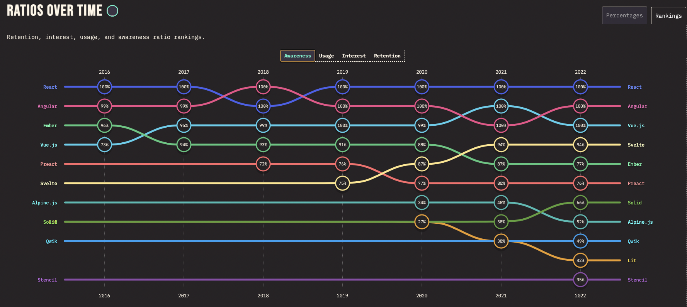
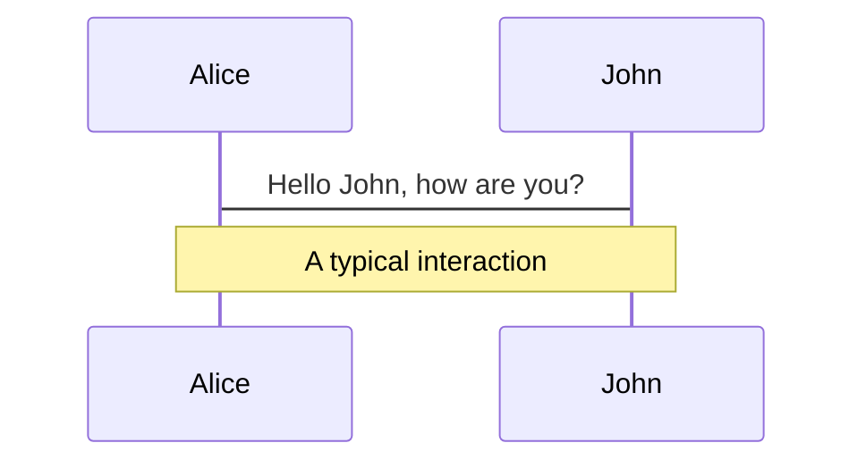
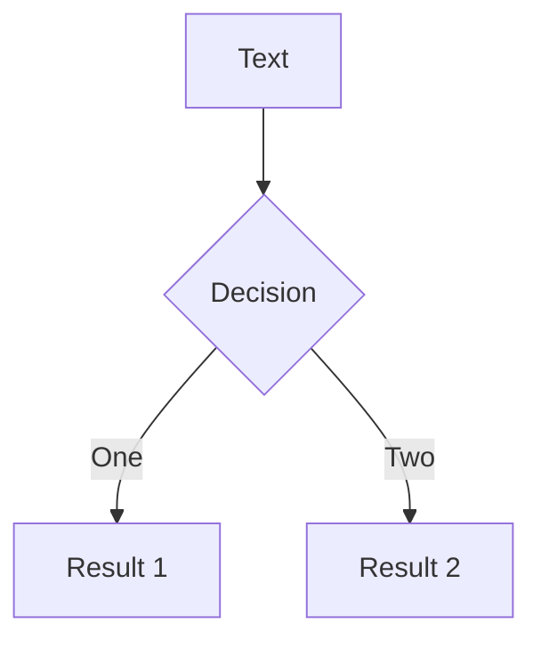
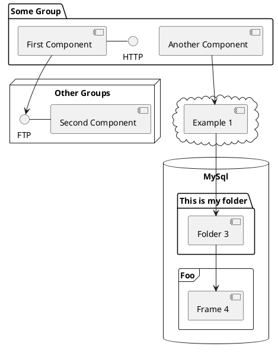

---
# try also 'default' to start simple
theme: apple-basic
# random image from a curated Unsplash collection by Anthony
# like them? see https://unsplash.com/collections/94734566/slidev
background: https://cover.sli.dev
# some information about your slides, markdown enabled
title: Welcome to Digital culture
info: |
  ## Slidev Starter Template
  Presentation slides for developers.

  Learn more at [Sli.dev](https://sli.dev)
# apply any unocss classes to the current slide
class: text-center
# https://sli.dev/custom/highlighters.html
highlighter: shiki
# https://sli.dev/guide/drawing
drawings:
  persist: false
# slide transition: https://sli.dev/guide/animations#slide-transitions
transition: slide-left
# enable MDC Syntax: https://sli.dev/guide/syntax#mdc-syntax
mdc: true
---

# Do you have to be up to date with the latest JS frameworks and web trends to be a good developer?

Digital culture

<div class="pt-12">
  <span @click="$slidev.nav.next" class="px-2 py-1 rounded cursor-pointer" hover="bg-white bg-opacity-10">
    Press Space for next page <carbon:arrow-right class="inline"/>
  </span>
</div>

<div class="abs-br m-6 flex gap-2">
  <button @click="$slidev.nav.openInEditor()" title="Open in Editor" class="text-xl slidev-icon-btn opacity-50 !border-none !hover:text-white">
    <carbon:edit />
  </button>
  <a href="https://github.com/slidevjs/slidev" target="_blank" alt="GitHub" title="Open in GitHub"
    class="text-xl slidev-icon-btn opacity-50 !border-none !hover:text-white">
    <carbon-logo-github />
  </a>
</div>

<!--
The last comment block of each slide will be treated as slide notes. It will be visible and editable in Presenter Mode along with the slide. [Read more in the docs](https://sli.dev/guide/syntax.html#notes)
-->


<!--
Here is another comment.
-->

---
transition: fade-out
layout: two-cols
layoutClass: gap-16
---

# Summary

Do you have to be up to date with the latest JS frameworks and web trends to be a good developer?

::right::

<Toc v-click minDepth="1" maxDepth="2"></Toc>


---
transition: slide-up
level: 2
---

# 📈L’évolution des frameworks JS et la quête de performance



[//]: # ()

[//]: # (## Keyboard Shortcuts)

[//]: # ()

[//]: # (|                                                     |                             |)

[//]: # (|-----------------------------------------------------|-----------------------------|)

[//]: # (| <kbd>right</kbd> / <kbd>space</kbd>                 | next animation or slide     |)

[//]: # (| <kbd>left</kbd>  / <kbd>shift</kbd><kbd>space</kbd> | previous animation or slide |)

[//]: # (| <kbd>up</kbd>                                       | previous slide              |)

[//]: # (| <kbd>down</kbd>                                     | next slide                  |)

<!-- https://sli.dev/guide/animations.html#click-animations -->

<p v-after class="absolute bottom-23 left-45 opacity-30 transform -rotate-10">Here!</p>


---
layout: image-right
image: ./stateofjs-ratio-overtime.png
---

# I - Demande croissante de performance

Les utilisateurs exigent des applications web de plus en plus rapides et réactives, ce qui pousse les développeurs à
utiliser des frameworks qui optimisent les performances.

---
transition: slide-up
level: 3
---

# I - Demande croissante de performance

Les attentes des utilisateurs modernes
Les utilisateurs d'aujourd'hui ont des attentes élevées en matière de performance des applications web. Plusieurs
facteurs contribuent à cette demande croissante :

`Vitesse de chargement`

<div v-click>

```html

<div v-click>Les utilisateurs s'attendent à ce que les pages web se chargent en quelques secondes, voire
    moins. Des temps de chargement rapides sont essentiels pour améliorer l'expérience utilisateur et réduire les taux
    de
    rebond. Google a également souligné l'importance de la vitesse de chargement pour le référencement, ce qui incite
    encore
    plus les développeurs à optimiser les performances.
</div>
```

</div>

<br>

<v-click>

<span v-mark.red="3"><code>Réactivité</code></span>

[//]: # (also allows you to add)

[//]: # (<span v-mark.circle.orange="4">inline marks</span>)

[//]: # (, powered by [Rough Notation]&#40;https://roughnotation.com/&#41;:)

```html
<span v-mark.underline.orange> : Une fois la page chargée, les interactions avec le site doivent être fluides et instantanées. Cela inclut
des actions comme la navigation, le défilement, et l'interaction avec les éléments de la page (par exemple, des
formulaires, des boutons, etc.).</span>
```

</v-click>

<div mt-20 v-click>

[Learn More](https://sli.dev/guide/animations#click-animations)

</div>

---

[//]: # (# I - Demande croissante de performance)

`Expérience utilisateur (UX)`

<div v-click>

```html

<div v-click>Une bonne performance est un élément clé d'une expérience utilisateur positive. Les
    utilisateurs sont moins tolérants envers les sites lents ou non réactifs et sont plus susceptibles de quitter un
    site ou
    de ne pas y revenir s'ils rencontrent des problèmes de performance.
</div>
```

</div>


---

# I - Demande croissante de performance

Rôle des frameworks JavaScript

Pour répondre à ces exigences, les développeurs se tournent vers des frameworks JavaScript modernes qui offrent des
outils et des fonctionnalités pour optimiser les performances. Voici comment ces frameworks contribuent à améliorer la
performance des applications web :

`Rendu côté client vs côté serveur`

<div v-click>

```html

<div v-click> : Certains frameworks permettent un rendu côté serveur (SSR) ou un rendu statique, ce
    qui peut réduire le temps de chargement initial de la page. D'autres, comme React avec ReactDOM, se concentrent sur
    le
    rendu côté client, permettant des interactions ultra-rapides après le chargement initial.
</div>
```

</div>

<br>

`Chargement paresseux (Lazy Loading)`

<div v-click>

```html

<div v-click> Les frameworks modernes intègrent souvent des techniques de chargement paresseux
    pour différer le chargement de contenu non critique jusqu'à ce qu'il soit nécessaire. Cela améliore le temps de
    chargement initial et réduit la consommation de bande passante.
</div>
```

</div>

---

# I - Demande croissante de performance

`Gestion de l'état efficace`

<div v-click>

```html

<div v-click>Les frameworks offrent des solutions sophistiquées pour la gestion de l'état de l'
    application, ce qui permet de minimiser les recalculs et les re-rendus inutiles. Cela contribue à des interactions
    plus
    rapides et à une expérience utilisateur plus fluide.
</div>
```

</div>

<br>

`Optimisation des bundles`

<div v-click>

```html

<div v-click>Les outils de build modernes, souvent intégrés aux frameworks, permettent de créer des
    bundles JavaScript optimisés et minifiés, réduisant ainsi la taille des fichiers envoyés au client et améliorant les
    temps de chargement.
</div>
```

</div>


---

# I - Demande croissante de performance

Exemples de frameworks performants

`React`

<div v-click>

```html

<div v-click>Utilisé par de grandes entreprises comme Facebook et Instagram, React permet de créer des interfaces
    utilisateur
    réactives et performantes grâce à son DOM virtuel et à ses techniques de mise à jour efficace.
</div>
```

</div>

<br>

`Vue.js`

<div v-click>

```html

<div v-click>Connu pour sa simplicité et sa flexibilité, Vue.js permet également des optimisations de performance avec
    son
    DOM virtuel et sa gestion de composants légers.
</div>
```

</div>

---

`Svelte`

<div v-click>

```html

<div v-click>Contrairement à React et Vue, Svelte convertit les composants en un code JavaScript ultra-optimisé au
    moment de
    la compilation, éliminant ainsi le besoin d'un DOM virtuel et améliorant la performance.
</div>
```

</div>

<br>

`Angular`

<div v-click>

```html

<div v-click>Un framework complet qui offre des outils puissants pour optimiser les performances, notamment par le biais
    de
    l'injection de dépendances et du rendu côté serveur.
</div>
```

</div>


En conclusion, la demande croissante de performance pousse les développeurs à utiliser des frameworks JavaScript
modernes qui offrent des outils et des techniques pour optimiser les applications web. Ces frameworks permettent de
répondre aux attentes des utilisateurs en matière de vitesse, de réactivité et de qualité de l'expérience utilisateur.

---

[//]: # (```ts {all|5|7|7-8|10|all} twoslash)

[//]: # (// TwoSlash enables TypeScript hover information)

[//]: # (// and errors in markdown code blocks)

[//]: # (// More at https://shiki.style/packages/twoslash)

[//]: # ()

[//]: # (import {computed, ref} from 'vue')

[//]: # ()

[//]: # (const count = ref&#40;0&#41;)

[//]: # (const doubled = computed&#40;&#40;&#41; => count.value * 2&#41;)

[//]: # ()

[//]: # (doubled.value = 2)

[//]: # (```)

[//]: # (<arrow v-click="[4, 5]" x1="350" y1="310" x2="195" y2="334" color="#953" width="2" arrowSize="1" />)

<!-- This allow you to embed external code blocks -->

[//]: # (<<< @/snippets/external.ts#snippet)

<!-- Footer -->

[//]: # ([^1]: [Learn More]&#40;https://sli.dev/guide/syntax.html#line-highlighting&#41;)

<!-- Inline style -->

[//]: # (<style>)

[//]: # (.footnotes-sep {)

[//]: # (  @apply mt-5 opacity-10;)

[//]: # (})

[//]: # (.footnotes {)

[//]: # (  @apply text-sm opacity-75;)

[//]: # (})

[//]: # (.footnote-backref {)

[//]: # (  display: none;)

[//]: # (})

[//]: # (</style>)

<!--
Notes can also sync with clicks

[click] This will be highlighted after the first click

[click] Highlighted with `count = ref(0)`

[click:3] Last click (skip two clicks)
-->

---
layout: image-left
image: ./stateofjs-ratio-overtime.png
---

# II - Innovation et compétition entre les frameworks

Différentes options de frameworks JS disponibles, de leur évolution constante pour répondre aux besoins
changeants du marché et de la compétition entre eux pour attirer les
développeurs. [learn more](https://2022.stateofjs.com/en-US/libraries/front-end-frameworks/)

---
level: 2
---

# II - Innovation et compétition entre les frameworks

Diversité des options disponibles

Le paysage des frameworks JavaScript est riche et diversifié, offrant de nombreuses options aux développeurs. Voici
quelques-uns des principaux frameworks et leurs caractéristiques distinctives :

`React `

<div v-click>

```html

<div v-click>Créé par Facebook, React est une bibliothèque JavaScript centrée sur la construction d'interfaces
    utilisateur
    réactives. Sa popularité repose sur son approche innovante du DOM virtuel, qui permet des mises à jour de
    l'interface
    utilisateur ultra-rapides.
</div>
```

</div>

<br>

`Angular`

<div v-click>

```html

<div v-click>Développé par Google, Angular est un framework complet qui offre une architecture robuste et une riche
    suite
    d'outils pour le développement d'applications web. Il est connu pour sa puissante fonctionnalité d'injection de
    dépendances et sa capacité à gérer des applications complexes.
</div>
```

</div>

---

Diversité des options disponibles

`Vue.js`

<div v-click>

```html

<div v-click>Vue.js se distingue par sa simplicité et sa flexibilité. Il combine les meilleures idées de React et
    Angular,
    offrant une courbe d'apprentissage douce tout en permettant de créer des applications performantes et maintenables.
</div>
```

</div>

<br>

`Svelte`

<div v-click>

```html

<div v-click>Svelte adopte une approche différente en compilant les composants en du JavaScript pur à l'étape de la
    construction. Cela élimine le besoin d'un DOM virtuel et peut conduire à des performances améliorées et à des
    tailles de
    bundle plus petites.
</div>
```

</div>

---

# II - Innovation et compétition entre les frameworks

Évolution constante pour répondre aux besoins du marché

Les frameworks JavaScript évoluent constamment pour s'adapter aux besoins changeants des développeurs et du marché.
Voici quelques-unes des tendances et évolutions récentes :

`Performance`

<div v-click>

```html

<div v-click>Les améliorations continues en matière de performance sont une priorité. Les frameworks optimisent
    constamment le rendu, la gestion de l'état et les temps de chargement pour offrir des expériences utilisateur plus
    rapides et plus fluides.
</div>
```

</div>

<br>

`Modularité et extensibilité`

<div v-click>

```html

<div v-click>Les frameworks deviennent de plus en plus modulaires, permettant aux développeurs de
    choisir et de composer des fonctionnalités selon leurs besoins spécifiques. Cela favorise la réutilisabilité et la
    maintenance du code.
</div>
```

</div>

---

Évolution constante pour répondre aux besoins du marché

`TypeScript`

<div v-click>

```html

<div v-click>De plus en plus de frameworks adoptent TypeScript, un sur-ensemble de JavaScript qui ajoute des types
    statiques. Cela améliore la qualité du code, facilite la collaboration en équipe et réduit les erreurs au moment de
    la
    compilation.
</div>
```

</div>

<br>

`Outillage et écosystème`

<div v-click>

```html

<div v-click>L'écosystème des outils autour des frameworks s'enrichit. Cela inclut des bibliothèques pour
    le routage, la gestion de l'état, le testing, le déploiement, etc. Un écosystème robuste aide les développeurs à
    être
    plus productifs et à créer des applications plus robustes.
</div>
```

</div>

---

# II - Innovation et compétition entre les frameworks

Compétition entre les frameworks

La compétition entre les frameworks JavaScript est intense et se manifeste de plusieurs manières :

`Communauté et support`

<div v-click>

```html

<div v-click>Les frameworks cherchent à attirer des communautés de développeurs actives et engagées. Une
    grande communauté signifie plus de ressources, de tutoriels, de plugins et de support pour les développeurs.
```

</div>

<br>

`Adoption par les entreprises`

<div v-click>

```html

<div v-click>Les frameworks se battent pour être adoptés par les grandes entreprises et les projets de
    haut profil. L'adoption par des entreprises de renom peut servir de preuve de fiabilité et de performance.
</div>
```

</div>

---

Évolution constante pour répondre aux besoins du marché

`Innovation technologique`

<div v-click>

```html

<div v-click>Chaque framework essaie de se différencier par l'innovation. Par exemple, React a popularisé
    le concept du DOM virtuel, tandis que Svelte propose une compilation des composants en JavaScript pur.
</div>
```

</div>

<br>

`Simplicité et courbe d'apprentissage`

<div v-click>

```html

<div v-click>Les frameworks rivalisent pour offrir la meilleure expérience développeur, en
    rendant leurs API intuitives et en fournissant une documentation claire et des guides pratiques. Vue.js, par
    exemple,
    est apprécié pour sa simplicité et sa courbe d'apprentissage douce.
</div>
```

</div>

---

# II - Innovation et compétition entre les frameworks

Exemples concrets de compétition

`React vs Angular`

<div v-click>

```html

<div v-click>Ces deux frameworks ont des approches différentes. React se concentre sur la bibliothèque pour les
    vues, laissant le choix des autres outils aux développeurs, tandis qu'Angular offre une solution complète avec tout
    intégré.
```

</div>

<br>

`Vue.js vs Svelte`

<div v-click>

```html

<div v-click> Vue.js est connu pour sa flexibilité et sa facilité d'apprentissage, tandis que Svelte se distingue
    par son approche unique de compilation. Les deux cherchent à offrir des performances élevées et une bonne expérience
    développeur.
</div>
```

</div>

En conclusion, l'innovation et la compétition entre les frameworks JavaScript stimulent le progrès technologique et
offrent aux développeurs une multitude d'options pour répondre à leurs besoins spécifiques. Cette dynamique
concurrentielle contribue à l'amélioration continue des outils et des pratiques de développement web.

---
transition: slide-up
level: 2
---

# 🤓 Le cliché du développeur junior vs senior

Les utilisateurs exigent des applications web de plus en plus
rapides et réactives, ce qui pousse les développeurs à utiliser des frameworks qui optimisent les
performances. [learn more](https://2022.stateofjs.com/en-US/libraries/front-end-frameworks/)


---
level: 2
---

---
layout: image-right
image: ./podcast-talk.png
---

# I - Les attentes et les réalités

Discute des différences entre les attentes souvent associées aux développeurs juniors (
moins d'expérience mais plus de familiarité avec les nouvelles technologies) et celles des développeurs seniors (plus
d'expérience mais parfois moins au courant des dernières tendances).

---
layout: image-left
image: ./podcast-talk.png
---

# II - La valeur de l'expérience

Mets en évidence l'importance de l'expérience dans la résolution de problèmes complexes, la
prise de décisions éclairées et la conception de solutions robustes et évolutives.


---
level: 2
---

---
transition: slide-up
level: 2
---

# 👩🏽‍💻 L'IA est-elle donc destinée aux développeurs moyens ?

Les utilisateurs exigent des applications web de plus en plus
rapides et réactives, ce qui pousse les développeurs à utiliser des frameworks qui optimisent les
performances. [learn more](https://2022.stateofjs.com/en-US/libraries/front-end-frameworks/)


---
level: 2
---

---
layout: image-right
image: ./chatgpt-intro.jpg
---

# I - Accessibilité de l'IA pour tous les niveaux

Explique comment les outils et plateformes d'IA deviennent de plus en plus
accessibles aux développeurs de tous niveaux, offrant des fonctionnalités de codage assisté, de génération de code et de
compréhension du langage naturel.

---
layout: image-left
image: ./githubcopilot-chat.png
---

# II - Utilisation de l'IA dans le développement web

Présente des exemples concrets d'utilisation de l'IA dans le
développement web, tels que la génération de code avec Copilot, l'analyse sémantique avec ChatGPT, etc.

[//]: # (# Shiki Magic Move)

[//]: # ()

[//]: # (Powered by [shiki-magic-move]&#40;https://shiki-magic-move.netlify.app/&#41;, Slidev supports animations across multiple code)

[//]: # (snippets.)

[//]: # ()

[//]: # (Add multiple code blocks and wrap them with <code>````md magic-move</code> &#40;four backticks&#41; to enable the magic move.)

[//]: # (For example:)

[//]: # ()

[//]: # (````md magic-move)

[//]: # (```ts {*|2|*})

[//]: # (// step 1)

[//]: # (const author = reactive&#40;{)

[//]: # (  name: 'John Doe',)

[//]: # (  books: [)

[//]: # (    'Vue 2 - Advanced Guide',)

[//]: # (    'Vue 3 - Basic Guide',)

[//]: # (    'Vue 4 - The Mystery')

[//]: # (  ])

[//]: # (}&#41;)

[//]: # (```)

[//]: # ()

[//]: # (```ts {*|1-2|3-4|3-4,8})

[//]: # (// step 2)

[//]: # (export default {)

[//]: # (  data&#40;&#41; {)

[//]: # (    return {)

[//]: # (      author: {)

[//]: # (        name: 'John Doe',)

[//]: # (        books: [)

[//]: # (          'Vue 2 - Advanced Guide',)

[//]: # (          'Vue 3 - Basic Guide',)

[//]: # (          'Vue 4 - The Mystery')

[//]: # (        ])

[//]: # (      })

[//]: # (    })

[//]: # (  })

[//]: # (})

[//]: # (```)

[//]: # ()

[//]: # (```ts)

[//]: # (// step 3)

[//]: # (export default {)

[//]: # (  data: &#40;&#41; => &#40;{)

[//]: # (    author: {)

[//]: # (      name: 'John Doe',)

[//]: # (      books: [)

[//]: # (        'Vue 2 - Advanced Guide',)

[//]: # (        'Vue 3 - Basic Guide',)

[//]: # (        'Vue 4 - The Mystery')

[//]: # (      ])

[//]: # (    })

[//]: # (  }&#41;)

[//]: # (})

[//]: # (```)

[//]: # ()

[//]: # (Non-code blocks are ignored.)

[//]: # ()

[//]: # (```vue)

[//]: # (<!-- step 4 -->)

[//]: # (<script setup>)

[//]: # (const author = {)

[//]: # (  name: 'John Doe',)

[//]: # (  books: [)

[//]: # (    'Vue 2 - Advanced Guide',)

[//]: # (    'Vue 3 - Basic Guide',)

[//]: # (    'Vue 4 - The Mystery')

[//]: # (  ])

[//]: # (})

[//]: # (</script>)

[//]: # (```)

[//]: # (````)

---

# Components

<div grid="~ cols-2 gap-4">
<div>

You can use Vue components directly inside your slides.

We have provided a few built-in components like `<Tweet/>` and `<Youtube/>` that you can use directly. And adding your
custom components is also super easy.

```html

<Counter :count="10"/>
```

<!-- ./components/Counter.vue -->
<Counter :count="10" m="t-4" />

Check out [the guides](https://sli.dev/builtin/components.html) for more.

</div>
<div>

```html

<Tweet id="1390115482657726468"/>
```

<Tweet id="1390115482657726468" scale="0.65" />

</div>
</div>

<!--
Presenter note with **bold**, *italic*, and ~~striked~~ text.

Also, HTML elements are valid:
<div class="flex w-full">
  <span style="flex-grow: 1;">Left content</span>
  <span>Right content</span>
</div>
-->

---
class: px-20
---

# Themes

Slidev comes with powerful theming support. Themes can provide styles, layouts, components, or even configurations for
tools. Switching between themes by just **one edit** in your frontmatter:

<div grid="~ cols-2 gap-2" m="t-2">

```yaml
---
theme: default
---
```

```yaml
---
theme: seriph
---
```


</div>

Read more about [How to use a theme](https://sli.dev/themes/use.html) and
check out the [Awesome Themes Gallery](https://sli.dev/themes/gallery.html).

---

# Clicks Animations

You can add `v-click` to elements to add a click animation.

<div v-click>

This shows up when you click the slide:

```html

<div v-click>This shows up when you click the slide.</div>
```

</div>

<br>

<v-click>

The <span v-mark.red="3"><code>v-mark</code> directive</span>
also allows you to add
<span v-mark.circle.orange="4">inline marks</span>
, powered by [Rough Notation](https://roughnotation.com/):

```html
<span v-mark.underline.orange>inline markers</span>
```

</v-click>

<div mt-20 v-click>

[Learn More](https://sli.dev/guide/animations#click-animations)

</div>

---

# Motions

Motion animations are powered by [@vueuse/motion](https://motion.vueuse.org/), triggered by `v-motion` directive.

```html

<div
        v-motion
        :initial="{ x: -80 }"
        :enter="{ x: 0 }"
        :click-3="{ x: 80 }"
        :leave="{ x: 1000 }"
>
    Slidev
</div>
```

<div class="w-60 relative">
  <div class="relative w-40 h-40">
    
    
    
  </div>

  <div
    class="text-5xl absolute top-14 left-40 text-[#2B90B6] -z-1"
    v-motion
    :initial="{ x: -80, opacity: 0}"
    :enter="{ x: 0, opacity: 1, transition: { delay: 2000, duration: 1000 } }">
    Slidev
  </div>
</div>

<!-- vue script setup scripts can be directly used in markdown, and will only affects current page -->
<script setup lang="ts">
const final = {
  x: 0,
  y: 0,
  rotate: 0,
  scale: 1,
  transition: {
    type: 'spring',
    damping: 10,
    stiffness: 20,
    mass: 2
  }
}
</script>

<div
  v-motion
  :initial="{ x:35, y: 30, opacity: 0}"
  :enter="{ y: 0, opacity: 1, transition: { delay: 3500 } }">

[Learn More](https://sli.dev/guide/animations.html#motion)

</div>

---

# LaTeX

LaTeX is supported out-of-box powered by [KaTeX](https://katex.org/).

<br>

Inline $\sqrt{3x-1}+(1+x)^2$

Block
$$ {1|3|all}
\begin{array}{c}

\nabla \times \vec{\mathbf{B}} -\, \frac1c\, \frac{\partial\vec{\mathbf{E}}}{\partial t} &
= \frac{4\pi}{c}\vec{\mathbf{j}} \nabla \cdot \vec{\mathbf{E}} & = 4 \pi \rho \\

\nabla \times \vec{\mathbf{E}}\, +\, \frac1c\, \frac{\partial\vec{\mathbf{B}}}{\partial t} & = \vec{\mathbf{0}} \\

\nabla \cdot \vec{\mathbf{B}} & = 0

\end{array}
$$

<br>

[Learn more](https://sli.dev/guide/syntax#latex)

---

# Diagrams

You can create diagrams / graphs from textual descriptions, directly in your Markdown.

```mermaid
mindmap
  root((mindmap))
    Origins
      Long history
      ::icon(fa fa-book)
      Popularisation
        British popular psychology author Tony Buzan
    Research
      On effectiveness<br/>and features
      On Automatic creation
        Uses
            Creative techniques
            Strategic planning
            Argument mapping
    Tools
      Pen and paper
      Mermaid
```

<div class="grid grid-cols-4 gap-5 pt-4 -mb-6">









</div>

[Learn More](https://sli.dev/guide/syntax.html#diagrams)

---
foo: bar
dragPos:
square: -138,0,0,0
square: 691,33,167,_,-16
---

# Draggable Elements

Double-click on the draggable elements to edit their positions.

<br>

###### Directive Usage

```md

```

<br>

###### Component Usage

```md
<v-drag text-3xl>
  <carbon:arrow-up />
  Use the `v-drag` component to have a draggable container!
</v-drag>
```

<v-drag pos="653,234,253,_,-15">
  <div text-center text-3xl border border-main rounded>
    Double-click me!
  </div>
</v-drag>


---
src: ./pages/multiple-entries.md
hide: false
---

---

# Monaco Editor

Slidev provides built-in Monaco Editor support.

Add `{monaco}` to the code block to turn it into an editor:

```ts {monaco}
import {ref} from 'vue'
import {emptyArray} from './external'

const arr = ref(emptyArray(10))
```

Use `{monaco-run}` to create an editor that can execute the code directly in the slide:

```ts {monaco-run}
import {version} from 'vue'
import {emptyArray, sayHello} from './external'

sayHello()
console.log(`vue ${version}`)
console.log(emptyArray<number>(10).reduce(fib => [...fib, fib.at(-1)! + fib.at(-2)!], [1, 1]))
```

---
layout: center
class: text-center
---

# Learn More

[Documentations](https://sli.dev) · [GitHub](https://github.com/slidevjs/slidev) · [Showcases](https://sli.dev/showcases.html)
